# RainNet-MT-rainfall-prediction-APP
## PyQt5ライブラリに基づくデスクトップアプリケーション

本アプリケーションは、PyQt5ライブラリに基づくデスクトップアプリケーションであり、オフィスビルにおける室内環境モニタリングおよび降雨量予測システムとして設計されています。
IoT技術を活用したRainNet-MT（降水確率・降水量両方予測モデル）プラットフォームです。


## 1. アプリケーション概要

### 1.1 メインウィンドウ
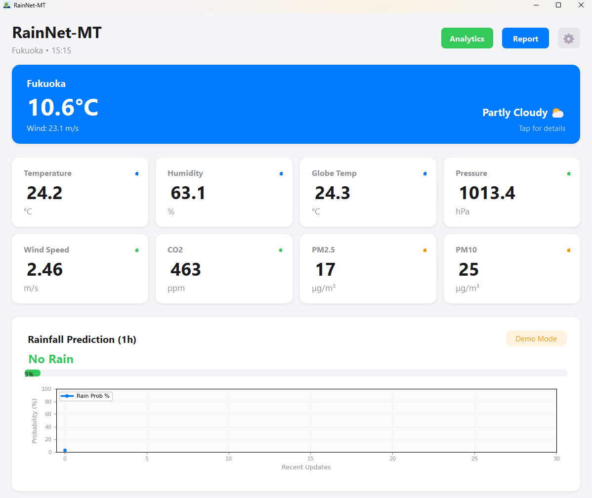
メインウィンドウは、オフィス環境の包括的な概要を提供し、以下の3つの主要な側面に焦点を当てています：

1). **室内環境モニタリング**
   - 温度、湿度、気圧、風速などのリアルタイムセンサーデータを表示
   - CO2濃度、PM2.5、PM10などの空気質指標を監視
   - グローブ温度（平均放射温度）の表示

2). **降雨量予測**
   - RainNet-MTモデルに基づく1時間先の降雨量予測
   - 降雨確率と強度（無降雨、小雨、中雨、大雨）の表示
   - リアルタイム予測結果の可視化

3). **天気情報**
   - Open-Meteo APIを使用した現地天気情報の表示
   - 気温、風速、天候状況のリアルタイム更新
   - 日本国内6都市（福岡、東京、大阪、名古屋、札幌、仙台）の選択可能

追加機能：
- MQTTプロトコルによるリアルタイムデータ受信
- MySQLデータベースとの連携による履歴データの保存・閲覧
- データ分析ダッシュボードによる包括的なデータ可視化
- ユーザーフレンドリーなインターフェース設計（Apple/Googleネイティブスタイル）
  
### 1.2 ログインウィンドウ

<table>
<tr>
<td width="60%">

- 都市選択機能（日本国内6都市から選択可能）
- ユーザー名の入力（オプション）
- ゲストモードでの利用も可能

</td>
<td width="40%" align="center">
  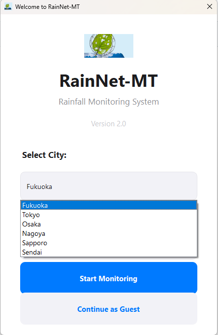
</td>
</tr>
</table>


### 1.3 データ分析ダッシュボード
- センサーデータの包括的な可視化
- 過去24時間のデータトレンド表示
- MySQLデータベースとのリアルタイム連携
- データのエクスポート機能

### 1.4 RainNet-MT予測モデル

RainNet-MTは、深層学習に基づく多タスク学習（Multi-Task Learning）降雨量予測モデルです。本モデルは、降雨発生の有無（Occurrence）と降雨強度（Intensity）を同時に予測する統合アーキテクチャを採用しています。


#### モデルアーキテクチャ

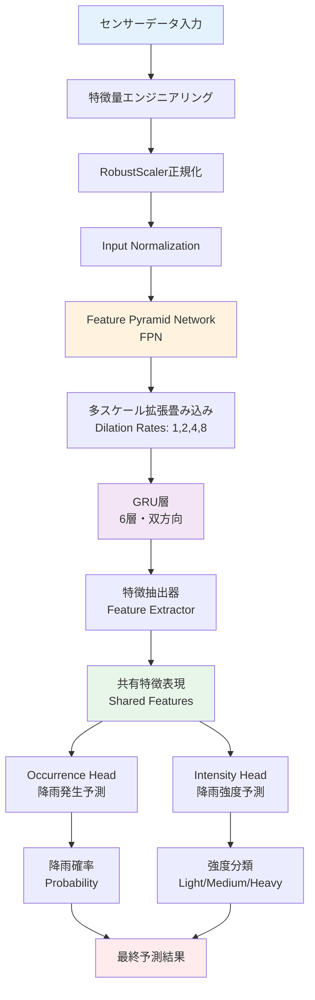

#### 主要コンポーネント

1. **Feature Pyramid Network (FPN)**
   - 多スケール時空間特徴抽出
   - 拡張畳み込み（Dilated Convolutions）による受容野の拡大
   - 異なる時間スケール（1h, 3h, 6h, 12h）の特徴を統合

2. **GRU層（Gated Recurrent Unit）**
   - 6層の深層GRUネットワーク
   - 時系列パターンの学習
   - 長期依存関係の捕捉

3. **多タスク学習ヘッド**
   - **Occurrence Head**: 降雨発生の有無を予測（二値分類）
   - **Intensity Head**: 降雨強度を3段階に分類（Light/Medium/Heavy）

4. **特徴エンジニアリング**
   - 時系列ラグ特徴（1h, 3h, 6h, 12h）
   - ローリング統計（平均、最大、標準偏差）
   - 気象変数の相互作用特徴
   - 循環時間特徴（時間、月、季節）

#### モデル性能

- **入力特徴数**: 200+ エンジニアリング特徴
- **隠れ層サイズ**: 512
- **ドロップアウト率**: 0.15
- **学習率**: 3e-4（AdamW最適化）
- **損失関数**: Focal Loss（クラス不均衡対応）

#### 予測フロー

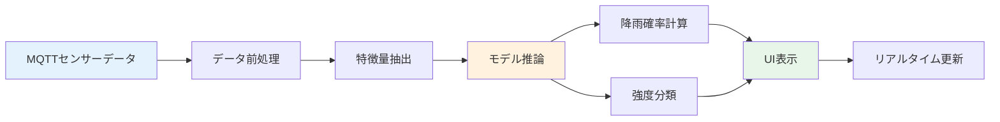

### 1.5 データベーストレンド表示
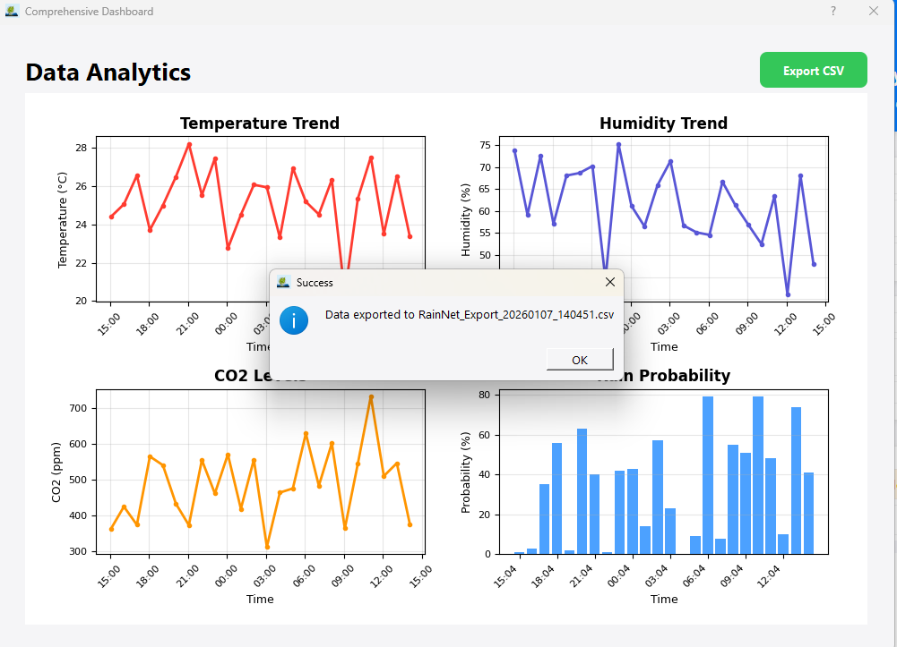
- 各センサー指標の過去データをグラフで表示
- データベースから直接データを取得
- インタラクティブなデータ探索機能

### 1.6 データエクスポート機能
- CSV形式でのデータエクスポート
- 時系列データの一括ダウンロード
- カスタマイズ可能なデータ範囲選択
<div align="center">
  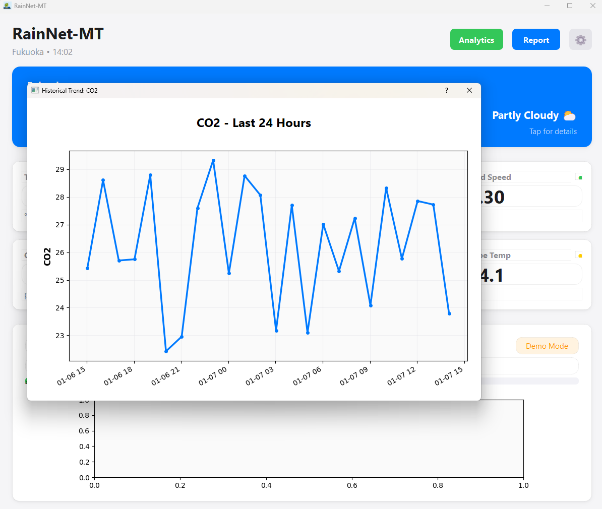
  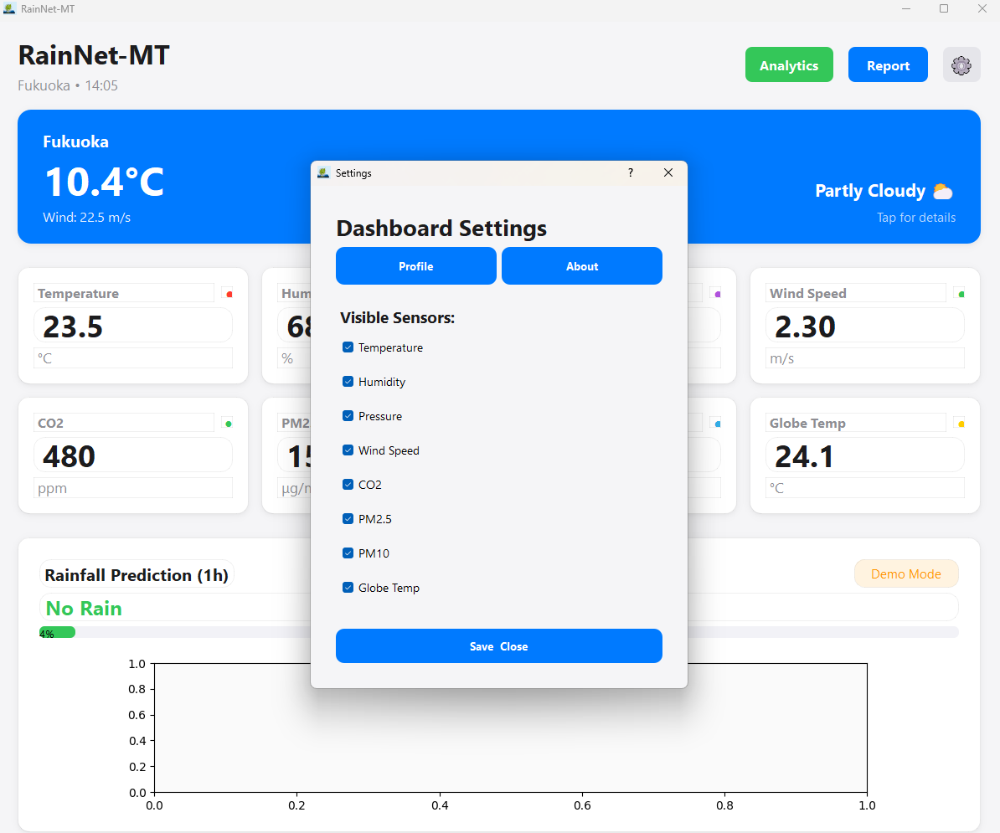
  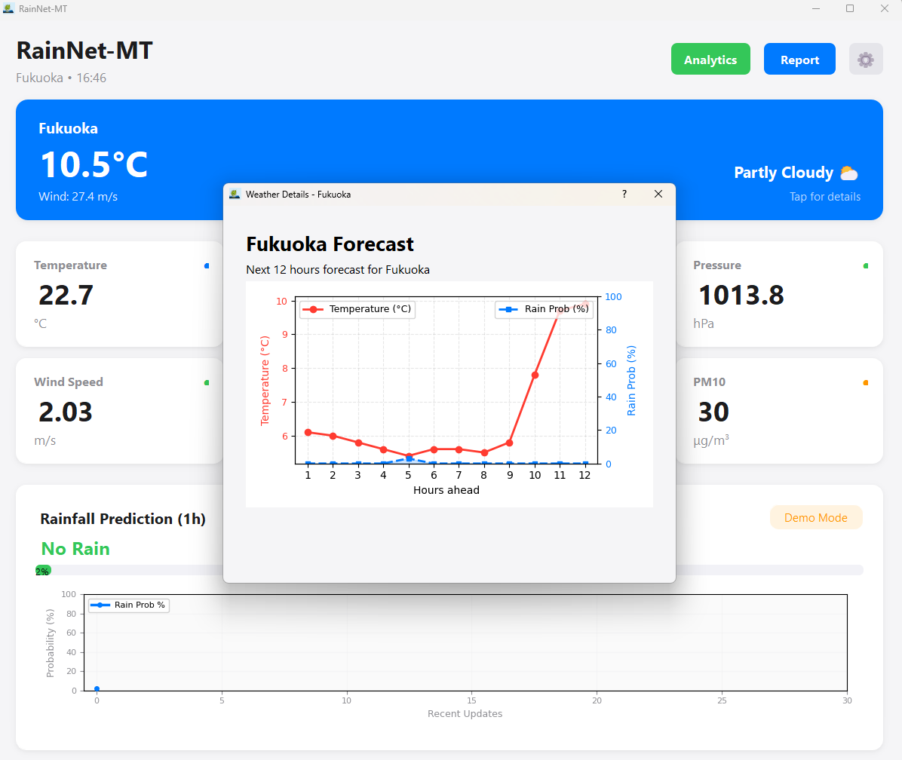
</div>


## 2. インストール

このプロジェクトをセットアップして実行するには、以下の手順に従ってください：

1. リポジトリをクローン：
```bash
   git clone https://github.com/your-repo/RainNet-MT.git](https://github.com/liuyuanru123/RainNet-MT-rainfall-prediction-APP.git
   cd RainNet-MT
```

2. **Python 3.7**以上がシステムにインストールされていることを確認してください。

3. 必要な依存関係をインストール：
```bash
   pip install -r requirements.txt
```
これにより、**PyQt5**を含むすべての必要なライブラリがインストールされます。

4. MySQLデータベースのセットアップ：
- MySQLがインストールされていない場合はインストールしてください
- プロジェクト用の新しいデータベースを作成してください
- 設定ファイル（該当する場合）でデータベース接続設定を更新してください

5. MQTTブローカーの設定：
- MQTTブローカーの接続情報を`Main.py`内で設定してください
- TLS/SSL証明書のパスを設定してください（該当する場合）

6. モデルのセットアップ（オプション）：
- 訓練済みモデルファイル（`best_rainnet_enhanced_mt.pth`）を配置
- Scalerファイル（`scaler.pkl`）を配置
- モデルパスを`Main.py`内で設定

7. アプリケーションを実行：
```bash
   python Main.py
```

### RainNet-MTアプリケーションのパッケージ化

**PyInstallerのインストール**：  
アプリケーションをパッケージ化するために、PyInstallerがインストールされていることを確認してください。pip経由でインストールできます：

```bash
   pip install pyinstaller
   pyinstaller Main.spec
```

## 3. 主要機能

### 3.1 リアルタイムセンサーモニタリング
- **温度**：室内温度のリアルタイム表示
- **湿度**：相対湿度の監視
- **気圧**：大気圧の測定
- **風速**：風速データの表示
- **CO2濃度**：二酸化炭素濃度の監視（色分け表示：緑=正常、黄=注意、赤=警告）
- **PM2.5/PM10**：微粒子物質の濃度測定
- **グローブ温度**：平均放射温度の表示

### 3.2 降雨量予測システム
- **1時間先予測**：RainNet-MTモデルによる降雨量予測
- **確率表示**：降雨確率のパーセンテージ表示
- **強度分類**：無降雨、小雨、中雨、大雨の4段階分類
- **リアルタイム更新**：MQTTデータ受信に基づく自動更新
- **可視化チャート**：過去30回の予測結果を時系列グラフで表示

### 3.3 天気情報表示
- **現地天気**：選択した都市の現在の天気情報
- **気温表示**：リアルタイム気温
- **風速情報**：風速データの表示
- **天候状況**：天候のテキスト説明

### 3.4 データ分析機能
- **包括的ダッシュボード**：すべてのセンサーデータの統合表示
- **トレンド分析**：過去データのグラフ表示
- **データエクスポート**：CSV形式でのデータ出力
- **データベース閲覧**：MySQLデータベースからの直接データ取得

### 3.5 ユーザー機能
- **活動レポート**：ユーザーの活動記録
- **ランキング表示**：ユーザースコアのランキング
- **プロフィール管理**：ユーザー情報の表示・編集
- **設定機能**：アプリケーション設定のカスタマイズ

## 4. REST API サーバー

### 4.1 API概要

`API.py`は、RainNet-MTシステムのバックエンドREST APIサーバーです。Flaskフレームワークを使用して実装されており、デスクトップアプリケーションとMySQLデータベース間の通信を提供します。
#### APIアーキテクチャ

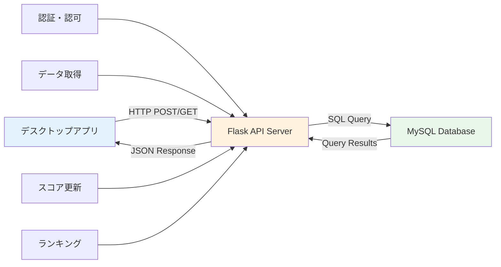

### 4.2 APIエンドポイント

#### 4.2.1 ユーザー認証

**`POST /login`**
- **機能**: ユーザーログイン認証
- **リクエストボディ**:
  ```json
  {
    "username": "user123",
    "password": "password123"
  }
  ```
- **レスポンス**:
  - 成功: `{"status": "success", "message": "Login successful"}`
  - 失敗: `{"status": "failure", "message": "Invalid username or password"}` (401)
- **セキュリティ**: bcryptによるパスワードハッシュ化

**`POST /check_username`**
- **機能**: ユーザー名の利用可能性をチェック
- **リクエストボディ**:
  ```json
  {
    "username": "newuser"
  }
  ```
- **レスポンス**:
  - 利用可能: `{"status": "available"}`
  - 使用中: `{"status": "taken"}`

**`POST /change_password`**
- **機能**: ユーザーパスワードの変更
- **リクエストボディ**:
  ```json
  {
    "username": "user123",
    "new_password": "newpassword123"
  }
  ```
- **レスポンス**:
  - 成功: `{"status": "success", "message": "Password updated successfully"}`
  - 失敗: `{"status": "failure", "message": "No rows updated"}` (400)

#### 4.2.2 ユーザーデータ管理

**`POST /fetch_user_data`**
- **機能**: ユーザー情報とスコアの取得
- **リクエストボディ**:
  ```json
  {
    "username": "user123"
  }
  ```
- **レスポンス**:
  ```json
  {
    "status": "success",
    "username": "user123",
    "score": 150
  }
  ```

**`POST /update_score`**
- **機能**: ユーザースコアの更新（活動レポート用）
- **リクエストボディ**:
  ```json
  {
    "username": "user123",
    "score": 10
  }
  ```
- **レスポンス**:
  - 成功: `{"status": "success", "message": "Score updated successfully"}`
  - 失敗: `{"status": "failure", "message": "No rows updated"}` (400)

**`GET /get_rankings`**
- **機能**: 全ユーザーのスコアランキング取得
- **レスポンス**:
  ```json
  [
    {"username": "user1", "score": 200},
    {"username": "user2", "score": 150},
    {"username": "user3", "score": 100}
  ]
  ```
- **ソート**: スコアの降順

#### 4.2.3 センサーデータ取得

**`POST /get_data`**
- **機能**: MySQLデータベースからセンサーデータを取得
- **リクエストボディ**:
  ```json
  {
    "table_name": "raspberry/mqtt"
  }
  ```
- **対応テーブル**: 
  - `raspberry/mqtt`
  - `raspberry/mqtt2`
  - `raspberry/mqtt3`
  - `raspberry/mqtt4`
  - `raspberry/mqtt5`
- **レスポンス**:
  ```json
  {
    "status": "success",
    "data": [
      {
        "Time": "2024-01-01 12:00:00",
        "Indoor_Temperature": 23.5,
        "Humidity": 65.0,
        "Pressure": 1013.2,
        "Wind_Speed": 2.3,
        "co2": 480,
        "pm25": 15,
        "pm10": 28
      }
    ]
  }
  ```
- **取得カラム**: 時間、室内温度、グローブ温度、気圧、湿度、平均放射温度、風速、PMV、CO2、PM2.5、PM10

#### 4.2.4 設定管理

**`POST /get_set_temperature`**
- **機能**: ユーザー設定の目標温度を取得
- **リクエストボディ**:
  ```json
  {
    "username": "user123"
  }
  ```
- **レスポンス**:
  ```json
  {
    "status": "success",
    "set_temperature": 25.0
  }
  ```

### 4.3 APIサーバーの起動

#### 基本的な起動方法

```bash
python API.py
```

#### 環境変数による設定

APIサーバーは環境変数による設定をサポートしています：

```bash
# Windows PowerShell
$env:MYSQL_HOST="127.0.0.1"
$env:MYSQL_USER="root"
$env:MYSQL_PASSWORD="your_password"
$env:MYSQL_DATABASE=""
$env:MYSQL_PORT="3306"
python API.py

#### デフォルト設定

環境変数が設定されていない場合、以下のデフォルト値が使用されます：
- **MYSQL_HOST**: `127.0.0.1`
- **MYSQL_USER**: `root`
- **MYSQL_PASSWORD**: `default_password`
- **MYSQL_DATABASE**: `databasename`
- **MYSQL_PORT**: `3306`

### 4.4 API使用例

#### Python クライアント例

```python
import requests

# APIベースURL
API_BASE = "http://192.168.83.7:5022"

# ユーザーデータ取得
response = requests.post(
    f"{API_BASE}/fetch_user_data",
    json={"username": "user123"},
    timeout=3
)
user_data = response.json()

# スコア更新
response = requests.post(
    f"{API_BASE}/update_score",
    json={"username": "user123", "score": 10},
    timeout=3
)

# ランキング取得
response = requests.get(f"{API_BASE}/get_rankings", timeout=3)
rankings = response.json()
```

### 4.5 セキュリティ機能

- **パスワードハッシュ化**: bcryptによる安全なパスワード保存
- **SQLインジェクション対策**: パラメータ化クエリの使用
- **エラーハンドリング**: 適切なHTTPステータスコードとエラーメッセージ

### 4.6 データベーススキーマ

APIは以下のMySQLテーブルと連携します：

- **`raspberry_UserID`**: ユーザー情報とスコア
  - `username` (VARCHAR)
  - `password` (VARCHAR, bcryptハッシュ)
  - `score` (INT)
  
- **`raspberry/mqtt`, `raspberry/mqtt2-5`**: センサーデータ履歴
  - `Time` (DATETIME)
  - `Indoor_Temperature` (FLOAT)
  - `Humidity` (FLOAT)
  - `Pressure` (FLOAT)
  - `Wind_Speed` (FLOAT)
  - `co2` (INT)
  - `pm25` (INT)
  - `pm10` (INT)

## 5. 技術仕様

### 5.1 使用技術
- **GUIフレームワーク**：PyQt5
- **データ通信**：MQTT（paho-mqtt）
- **データベース**：MySQL（pymysql）
- **データ処理**：NumPy、Pandas
- **可視化**：Matplotlib
- **天気API**：Open-Meteo API
- **深層学習**：PyTorch（RainNet-MTモデル）
- **REST API**：Flask

### 5.2 システム要件
- Python 3.7以上
- MySQL 5.7以上（オプション）
- MQTTブローカーへの接続（オプション）
- インターネット接続（天気情報取得用）
- PyTorch 1.8以上（モデル推論用、オプション）
- Flask 2.0以上（APIサーバー用）

### 5.3 対応OS
- Windows 10/11
- macOS（要検証）
- Linux（要検証）

## 6. モデル詳細

### 6.1 RainNet-MTアーキテクチャ

RainNet-MTは、以下の特徴を持つ深層学習モデルです：

- **多タスク学習**: 降雨発生と強度を同時に予測
- **時空間特徴抽出**: FPNとGRUによる多スケール特徴学習
- **クラス不均衡対応**: Focal Lossによる少数クラスの学習改善
- **正則化**: DropoutとWeight Decayによる過学習防止

### 6.2 特徴エンジニアリング

モデルは以下の特徴を使用します：

1. **時系列ラグ特徴**
   - 湿度、気圧、風速の1h, 3h, 6h, 12hラグ
   - 降雨状態の履歴特徴

2. **統計特徴**
   - ローリング平均、最大値、標準偏差
   - 変化率（差分）特徴

3. **相互作用特徴**
   - 風速と风向の交互作用
   - 温度と湿度の交互作用

4. **時間特徴**
   - 循環時間特徴（sin/cos変換）
   - 季節性特徴

### 6.3 モデル推論フロー

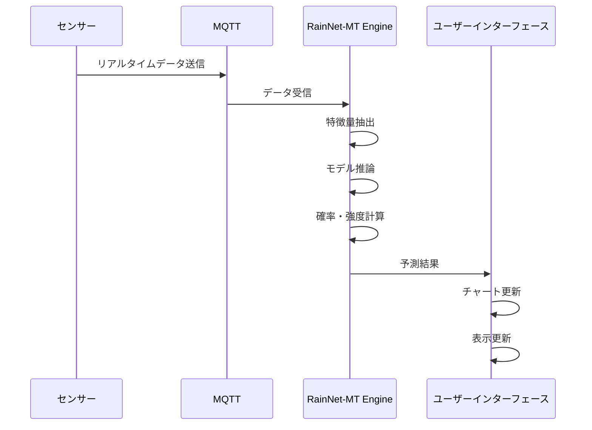

## 7. システムアーキテクチャ

### 7.1 全体システム構成

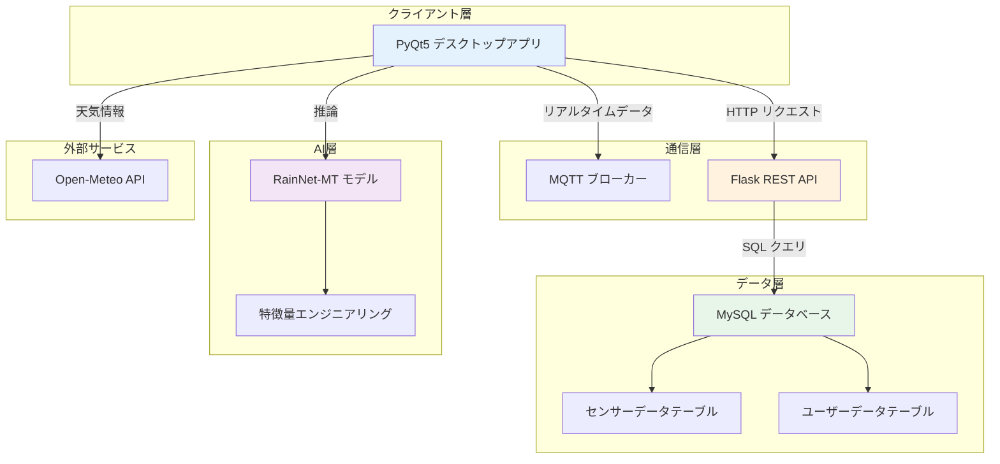

### 7.2 データフロー

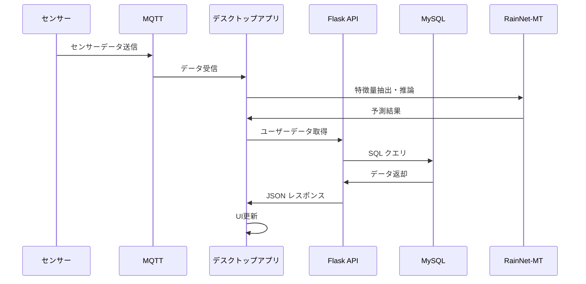

## 8. ライセンス
このプロジェクトはMITライセンスの下で公開されています。詳細については[LICENSE](LICENSE)ファイルを参照してください。
